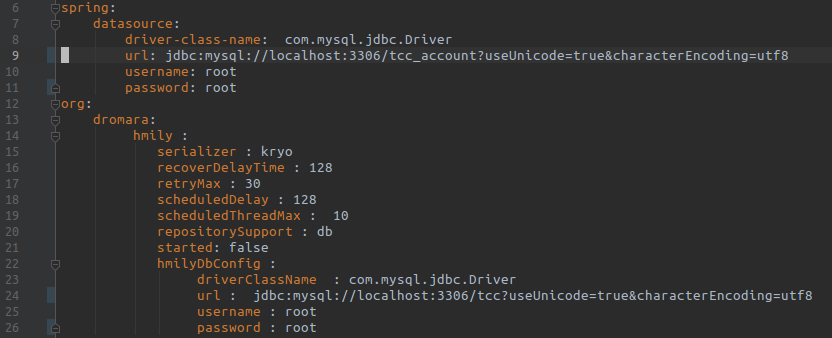
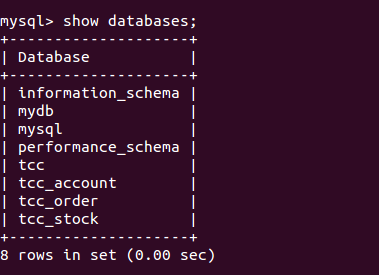
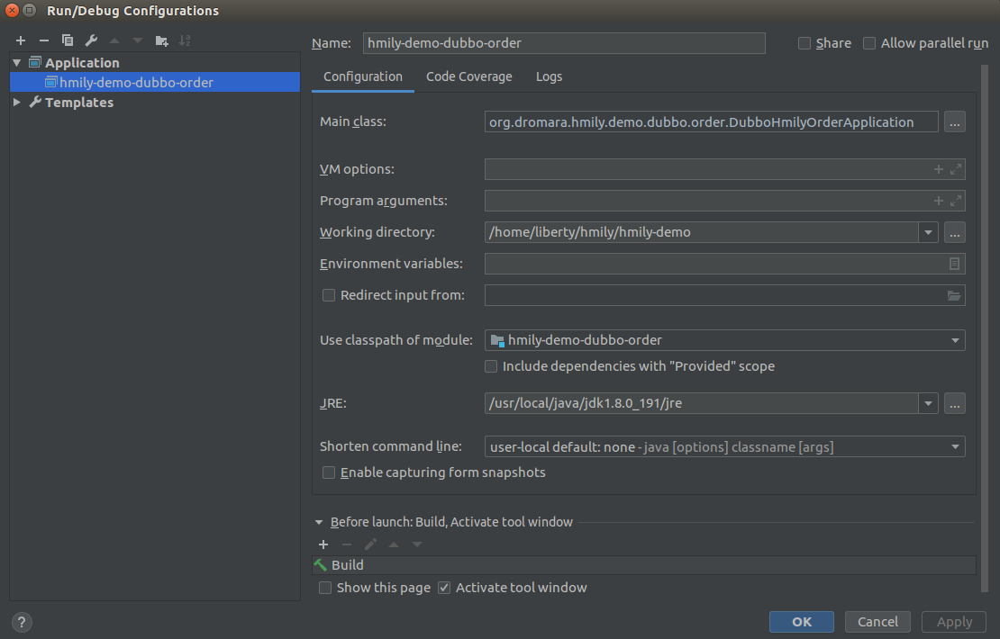
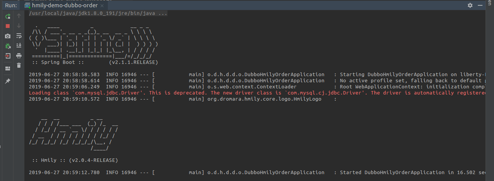
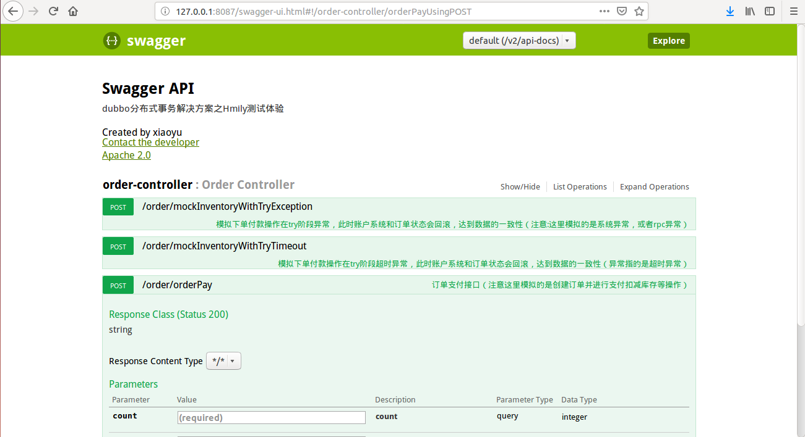

# himy-demo-dubbo启动说明
代码拉取:

```
$ git clone https://github.com/yu199195/hmily.git
$ cd hmily
$ mvn -DskipTests clean install -U
```

使用Idea打开`hmily-demo/`文件夹下的项目，修改`hmily-demo-dubbo-account`、`hmily-demo-dubbo-inventory`和`hmily-demo-dubbo-order`三个模块`resources/`下的`application.yml`和`spring-dubbo.xml`中的配置信息：

Mysql连接配置:



Zookeeper连接配置:


运行sql脚本`sql/hmily-demo.sql`，创建数据库如下：



在idea中启动`hmily-demo-dubbo-order`模块的启动类`DubboHmilyOrderApplication`，配置如下：



配置完成后项目可成功启动：



通过`http://127.0.0.1:8087/swagger-ui.html`即可访问项目的前端演示界面:

